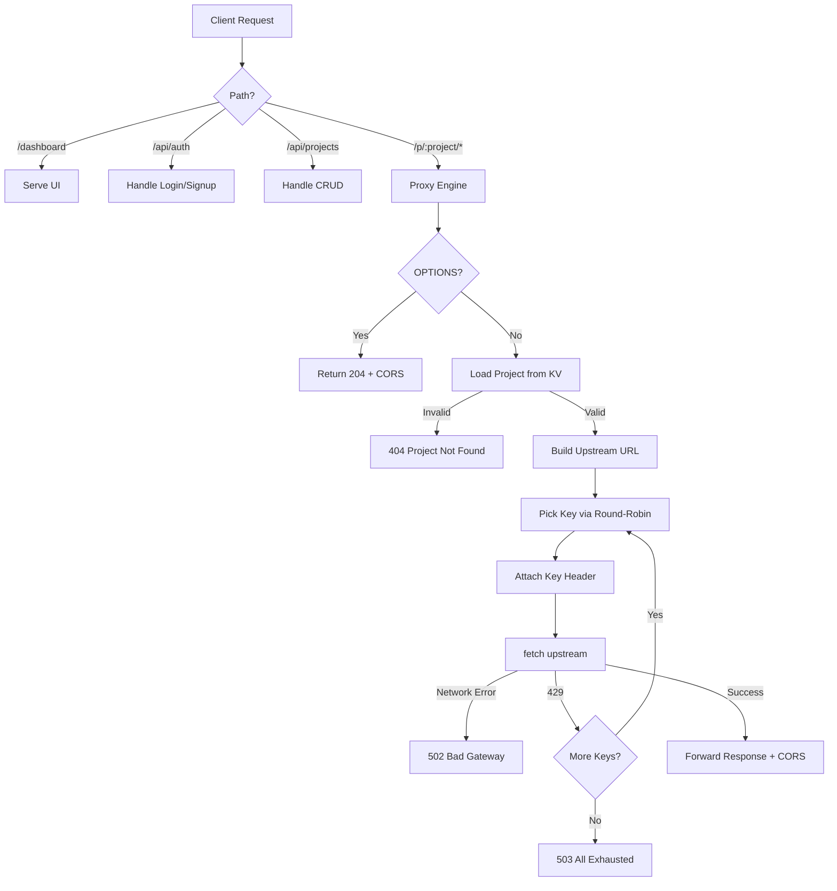

# Design: Route429

## Overview

Route429 is a stateless (edge-deployed) proxy and multi-tenant SaaS platform that transparently rotates API keys on rate-limit errors. This document captures the technical design decisions and their rationale.

## Design Decisions

### 1. Round-Robin Key Selection

**Decision**: Use an isolate-scoped counter (`roundRobinCounters` map keyed by project) to cycle through keys.

**Rationale**: 
- Simple, zero-overhead, no external state needed.
- Each V8 isolate maintains its own counters, so parallel isolates naturally spread across different keys.
- After a successful request, the counter advances so the *next* request starts from a different key.

**Trade-off**: Under high concurrency across multiple isolates, two isolates may pick the same key. This is acceptable because:
1. Rate limits apply across the *entire* key, so spreading requests probabilistically is sufficient.
2. If two isolates pick the same key and hit a 429, they will *both* rotate to their respective next keys.

### 2. Zero-Buffer Proxying

**Decision**: The request body is read once as a stream and forwarded. We do *not* buffer the request body in memory.

**Rationale**: 
- Critical for minimizing memory usage in Workers.
- Allows streaming large payloads without hitting Worker memory limits.

**Trade-off**: If a `POST` request fails with a 429, the body stream is already consumed. The proxy *cannot* automatically retry non-`GET`/`HEAD` requests on the next key because the body is gone. 
- **Current Behavior**: The worker returns the 429 to the client, but advances the key counter so the *client's* next retry uses a fresh key. 
- **Future fix**: For small payloads (< 1MB), we could conditionally buffer `request.clone().text()`.

### 3. Single-Worker Architecture (Monolith)

**Decision**: The entire application (UI, Auth API, Project Management, and Proxy Engine) is served from a single Cloudflare Worker.

**Rationale**: 
- Simplifies deployment (one `wrangler.toml`).
- Eliminates CORS issues between the frontend and the management API.
- The UI is served purely as inline HTML strings, avoiding the need for a separate hosting platform.

### 4. Authentication (PBKDF2)

**Decision**: Use `PBKDF2-SHA256` via the native Web Crypto API for password hashing.

**Rationale**: 
- Cloudflare Workers do not support standard Node.js native modules like `bcrypt`. 
- Using standard Web Crypto keeps the project dependency-free (no npm packages required).

## Security Considerations

| Concern | Mitigation |
|---|---|
| Key exposure in DB | API Keys are stored in Cloudflare KV, which is encrypted at rest. Passwords are hashed via PBKDF2. |
| Key exposure in logs | Masked to `first5...last3` when displayed in the dashboard. |
| Key exposure in responses | Keys are only added to upstream requests, never reflected to clients. |
| CORS abuse | Configurable `ALLOWED_ORIGINS` per project. |
| Upstream URL injection | `TARGET_BASE_URL` is configured per project in the dashboard; the client only controls the trailing path. |

## Flow Diagram

