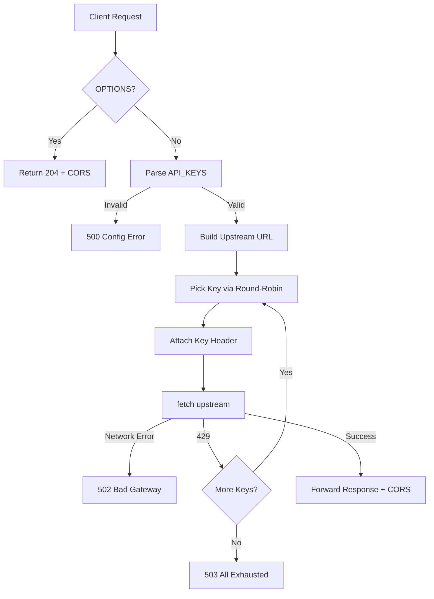

# Route429 — Design Document

## Overview

Route429 is a stateless, edge-deployed proxy that transparently rotates API keys on rate-limit errors. This document captures the technical design decisions and their rationale.

## Design Decisions

### 1. Round-Robin Key Selection

**Decision**: Use an isolate-scoped counter (`roundRobinIndex`) to cycle through keys.

**Rationale**: 
- Simple, zero-overhead, no external state needed.
- Each V8 isolate maintains its own counter, so parallel isolates naturally spread across different keys.
- After a successful request, the counter advances so the *next* request starts from a different key.

**Trade-off**: Under high concurrency across multiple isolates, two isolates may pick the same key. This is acceptable because:
- The retry loop will still rotate through all keys.
- True distributed coordination (e.g., via KV or Durable Objects) would add latency and cost, defeating the "free tier" goal.

### 2. Retry Loop Bounded by Pool Size

**Decision**: Max retries = `keys.length`. Each retry uses the *next* key in sequence.

**Rationale**:
- Guarantees every key gets exactly one attempt before giving up.
- Prevents infinite retry storms.
- If all keys are rate-limited, the client gets a clear 503 instead of hanging.

### 3. Request Body Streaming

**Decision**: Pass `request.body` (a `ReadableStream`) directly to the upstream `fetch()`.

**Rationale**:
- Avoids buffering the entire body in memory (critical for large payloads).
- Cloudflare Workers have a 128 MB memory limit; streaming stays well within it.

**Caveat**: If the first key gets a 429, the body stream is consumed and cannot be replayed for the next key. However, for requests with bodies (POST/PUT/PATCH), the body is only consumed on the first `fetch()`. On 429, we consume the *response* body (to free the connection), but the request body is already sent. Subsequent retries will have `body: undefined` because the stream was consumed.

> **Important**: This means key rotation on 429 works perfectly for GET requests, but for POST/PUT/PATCH requests, the retry will send a request *without a body*. Most APIs will reject this with a 400, which the proxy will forward to the client. This is a known trade-off to avoid buffering.

**Mitigation option**: If body replay is needed, buffer the request body into an `ArrayBuffer` before the loop. This is safe for most AI API payloads (typically < 1 MB). A future enhancement could add this with a configurable size limit.

### 4. CORS Strategy

**Decision**: Full preflight + response header injection with configurable origins.

**Details**:
- `OPTIONS` returns 204 with `Access-Control-Allow-*` headers.
- All proxied responses get CORS headers injected.
- `Vary: Origin` is set when not using wildcard `*` (required for correct caching).
- `Access-Control-Max-Age: 86400` reduces preflight frequency.

### 5. Hop-by-Hop Header Stripping

**Decision**: Strip [RFC 2616 §13.5.1](https://www.rfc-editor.org/rfc/rfc2616#section-13.5.1) hop-by-hop headers from forwarded requests.

**Rationale**: These headers are connection-specific and must not be forwarded by proxies. Leaving them in can cause subtle breakage with certain upstream servers.

### 6. Error Response Format

**Decision**: All errors return structured JSON with `error` code and `message`.

```json
{
  "error": "all_keys_exhausted",
  "message": "All API keys in the pool have been rate-limited.",
  "retryAfter": "30"
}
```

**Rationale**: Clients can programmatically handle errors by switching on `error` code, and the `retryAfter` field (when present) enables smart client-side backoff.

### 7. Key Masking in Logs

**Decision**: Log only `first5...last3` characters of keys (e.g., `sk-pr...xyz`).

**Rationale**: Enables debugging which key was used without exposing the full secret in Cloudflare's log stream.

## Security Considerations

| Concern | Mitigation |
|---|---|
| Key exposure in code | Keys are Cloudflare Secrets (`wrangler secret put`), never in `wrangler.toml` |
| Key exposure in logs | Masked to `first5...last3` |
| Key exposure in responses | Keys are only added to upstream requests, never reflected to clients |
| CORS abuse | Configurable `ALLOWED_ORIGINS`; production should restrict to specific domains |
| Upstream URL injection | `TARGET_BASE_URL` is server-side config; client only controls the path |

## Flow Diagram



## Future Enhancements

- **Request body buffering** for POST/PUT retry support (with size limit)
- **KV-backed key state** to track per-key rate-limit windows across isolates
- **Durable Object coordinator** for true distributed round-robin
- **Analytics** via Workers Analytics Engine
- **Multiple target APIs** via path-based routing
